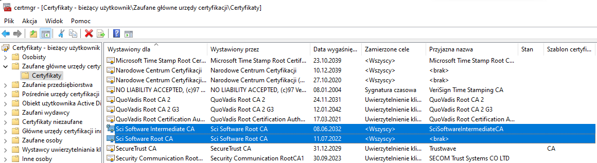

# Centrum Certyfikacyjne

Centrum zarządzania certyfikatami SSL oparte o openssl oraz skrypty bash.
Zbiór skryptów wspiera pracę i rejestrację certyfikatów podpisanych samodzielnie. Narzędzie przydatne gdy chcemy skutecznie, bezkosztowo, zarządzać certyfikatami SSL naszej wewnętrznej infrastruktury. Projekt [Let's Encrypt](https://letsencrypt.org/) pozwala na darmową obsługę certyfikacji naszych serwerów, lecz jego zastosowanie ma ograniczenie: **nasze usługi muszą być wystawione na świat** - proces walidacji serwera nie pozwala na korzystanie z certyfikatów na serwerach, które nie mają wyjścia na świat.

## Opis skryptów i plików

<details><summary>Opis zawartych w projekcie skryptów będących podstawą oprogramowania twojego Centrum Certyfikacyjnego.</summary>
  <p>
    
  ### ./setenv.sh
Skrypt pozwalający na ogólną konfigurację twojego Centrum Certyfikacyjnego.

  ### ./generate_root_ca.sh
Skrypt generacji klucza oraz certyfikatu "ROOT" CA - certyfikatu, którym będą podpisywane wszystkie certyfikaty pośrednie. Poprzez jego edycję zmień parametry skryptu w celu ustawienia CN oraz nazwy docelowej certyfikatu - spokojnie, robisz to tylko raz, bo wygenerowane CA trzeba będzie zmienić za 20 lat:
```bash
#CN=$1
#FRENDLY_NAME=$2
CN="Sci Software Root CA"
FRENDLY_NAME="SciSoftwareRootCA"
export CN FRENDLY_NAME  

DAYS=7300 #20 lata
export DAYS
```
Ustaw swoją konfigurację w pliku [./config/002_root_ca_openssl](/slawascichy/certificate_center/blob/main/config/002_root_ca_openssl.cnf) tak aby spełniała ona twoje wymagania i aby certyfikat CA reprezentował twoją organizację. Przykład:
```
[ req_distinguished_name ]
countryName              = PL
stateOrProvinceName      = Pomorskie
localityName             = Bojano
0.organizationName       = Sci Software
0.organizationalUnitName = IT o/Bojano
commonName               = ${ENV::CN}
0.DC                     = scisoftware
1.DC                     = pl
    
#...
[alt_names]
DNS.1 = "Sci Software Sławomir Cichy, https://scisoftware.pl"
```
  ### ./generate_intermediate_ca.sh
Skrypt generacji klucza oraz certyfikatu pośredniego CA - certyfikatu, którym będą podpisywane wszystkie wystawiane przez ciebie certyfikaty. Poprzez jego edycję zmień parametry skryptu w celu ustawienia CN oraz nazwy docelowej certyfikatu. Wygenerowane CA trzeba będzie zmienić za 10 lat:
```bash
#CN=$1
#FRENDLY_NAME=$2
CN="Sci Software Intermediate CA"
FRENDLY_NAME="SciSoftwareIntermediateCA"
export CN FRENDLY_NAME 

DAYS=3650 #10 lat
export DAYS
```    
Ustaw swoją konfigurację w pliku [./config/003_intermediate_ca_openssl.cnf](/slawascichy/certificate_center/blob/main/config/003_intermediate_ca_openssl.cnf) tak aby spełniała ona twoje wymagania i aby certyfikat CA reprezentował twoją organizację. Przykład:
```
[ req_distinguished_name ]
countryName              = PL
stateOrProvinceName      = Pomorskie
localityName             = Bojano
0.organizationName       = Sci Software
0.organizationalUnitName = IT o/Bojano
commonName               = ${ENV::CN}

#...
[alt_names]
DNS.1 = "Sci Software Sławomir Cichy, https://scisoftware.pl"
```
  ### ./init_oputput_dir.sh
Skrypt pozwalający nam na zainicjalizowanie katalogu, w którym składowane będą certyfikaty danej usługi/serwera. W katalogu zainicjalizowana zostanie konfiguracja oparta o plik [./config/001_main_openssl.cnf](/slawascichy/certificate_center/blob/main/config/001_main_openssl.cnf), dlatego ustaw w nim swoją konfigurację tak aby spełniała ona twoje wymagania i aby certyfikat CA reprezentował twoją organizację:
```
[ req_distinguished_name ]
countryName              = PL
stateOrProvinceName      = Pomorskie
localityName             = Bojano
0.organizationName       = Sci Software
0.organizationalUnitName = IT o/Bojano
commonName               = ${ENV::CN}
0.DC                     = scisoftware
1.DC                     = pl

#...
[alt_names]
DNS.1 = scisoftware.pl
DNS.2 = *.scisoftware.pl
DNS.3 = hgdb.org
DNS.4 = *.hgdb.org
DNS.5 = hgdb.io
DNS.6 = *.hgdb.io
```

  ### ./generate_server_cert.sh
Skrypt do generacji certyfikatu serwera. Skrypt generuje certyfikat request'u, klucz prywatny oraz sam certyfikat w katalogu o nazwie `./target/<nazwa_hosta_uslugi>`.

  ### ./generate_server_cert_star.sh
Skrypt do generacji certyfikatu z tzw. "gwiazdką" dla danej domeny serwerów. Skrypt generuje certyfikat request'u, klucz prywatny oraz sam certyfikat w katalogu o nazwie `./target/<nazwa_domeny>`.

  ### ./generate_server_cert_by_req.sh
Skryp pozwalający na generację certyfikatu na podstawie dostarczonego pliku request'u.

  ### ./config/001_main_openssl.cnf
Plik konfiguracji openSSL. Są tam zawarte główne dane o nas, jako zaufanym urzędzie certyfikacji (CA)

  ### ./config/002_root_ca_openssl.cnf
Plik konfiguracji openSSL. Są tam zawarte główne dane o nas, jako zaufanym urzędzie certyfikacji (CA). Wspiera generacje głównego ("ROOT") certyfikatu CA.

  ### ./config/003_intermediate_ca_openssl
Plik konfiguracji openSSL. Są tam zawarte główne dane o nas, jako zaufanym urzędzie certyfikacji (CA). Wspiera generacje pośredniego certyfikatu CA.
  
  ### ./database/serial
Plik przechowujący kolejny numer wygenerowanego certyfikatu (sekwencja).

  ### ./database/index.txt
Lista wygenerowanych przez ciebie certyfikatów. Ewidencja wydanych poświadczeń.

  ### ./database/index.txt.attr
Parametry uzupełniania listy wygenerowanych certyfikatów.

  </p>
</details>

## Instalacja
    
Aby móc generować klucze wymagane jest oprogramowanie [openSSL](https://wiki.ibpm.pro/index.php/OpenSSL).
Oprogramowanie sprawdzone na systemie operacyjnym CentOS oraz Windows przy użyciu nakładki Cygwin.

Poszczególne kroki instalacyjne:
- Umieść pliki projektu w utworzonym przez ciebie katalogu np. `/opt/security`.
- Zmień przykładową konfigurację pliku [./config/001_main_openssl.cnf](/slawascichy/certificate_center/blob/main/config/001_main_openssl.cnf) tak aby spełniał one twoje wymagania.
- Zmień przykładową konfigurację pliku [./config/002_root_ca_openssl.cnf](/slawascichy/certificate_center/blob/main/config/002_root_ca_openssl.cnf) tak aby spełniał one twoje wymagania. Zobacz opis skryptu `./generate_root_ca.sh`.
- Zmień przykładową konfigurację pliku [./config/003_intermediate_ca_openssl.cnf](/slawascichy/certificate_center/blob/main/config/003_intermediate_ca_openssl.cnf) tak aby spełniał one twoje wymagania. Zobacz opis skryptu `./generate_intermediate_ca.sh`.
- Zmień parametry środowiska w skrypcie `setenv.sh`.
- Zmień wartość parametru CN oraz FRENDLY_NAME w skrypcie `generate_root_ca.sh`.
- Zmień wartość parametru CN oraz FRENDLY_NAME w skrypcie `generate_intermediate_ca.sh`.
- Wygeneruj swój pierwszy certyfikat ROOT CA za pomocą skryptu `generate_root_ca.sh` - wygenerowany certyfikat będzie służył do podpisywania certyfikatów pośrednich.
- Wygeneruj swój pierwszy certyfikat pośredni CA za pomocą skryptu `generate_intermediate_ca.sh` - wygenerowany certyfikat będzie służył do podpisywania certyfikatów twoich serwerów. 
    
Przekaż wygenerowane certyfikaty, ROOT CA oraz certyfikat pośredni, współpracownikom. Jeżeli będą oni mieli je zainstalowane na komputerze w magazynie "Zaufanych głównych urzędów certyfikacji", ich przeglądarki będą tolerować/ufać serwerom, które będą obsługiwane przez twoje Centrum Certyfikacyjne.
    

Koniec instalacji.

## Generowanie certyfikatu dla usługi

Wymagania co do jakości certyfikatów się zwiększają i przez to wymagana jest indywidualna konfiguracja open SSL dla każdego wystawianego certyfikatu i stąd konieczność dodatkowej pracy manualnej. Poszczególne kroki generacji certyfikatu:
1. Przechodzimy do katalogu, w którym zainstalowaliśmy skrypty generacji certyfikatów.
2. Tworzymy (o ile już nie istnieje katalog) docelowy, w którym generowane będą poszczególne składowe certyfikatu.
```bash
# Przygotuj nazwę katalogu w zmiennej środowiskowej. Zmienna $CN reprezentuje pełną nazwę 
# serwera dla którego ma być wygenerowany certyfikat np. *wiki.example.com*
set CN=wiki.example.com
./init_oputput_dir.sh $CN
```
3. Podczas inicjalizacji w katalogu `./target` zostanie utworzony odpowiedni katalog o nazwie `$CN`, a w katalogu `./config` powinien pojawić się plik z konfiguracją o nazwie `$CN_openssl.cnf` gdzie `$CN` reprezentuje pełną nazwę serwera dla którego ma być wygenerowany certyfikat np. *wiki.example.com_openssl.cnf*. Ta dedykowana powinna być teraz dostosowana do potrzeb serwera. Zmieniamy sekcję `[alt_names]` tak aby ustawić wymagane dla certyfikatu alternatywne nazwy, np.:
```text
[alt_names]
DNS.1 = wiki.example.com
DNS.2 = www.wiki.example.com
DNS.3 = ipv4.wiki.example.com
DNS.4 = ipv6.wiki.example.com 
```
4. Generujemy certyfikat za pomocą polecenia:
```bash
./generate_server_cert.sh $CN    
```
Generacja certyfikatu jest interaktywna, tzn. że trzeba będzie odpowiedzieć na pytania:
```
Certificate is to be certified until Jun  6 13:52:54 2025 GMT (1095 days)
Sign the certificate? [y/n]:
```
Należy odpowiedzieć "y"
```
1 out of 1 certificate requests certified, commit? [y/n]
```
Należy odpowiedzieć "y"
```
Enter Export Password:
```
Należy wprowadzić hasło generowanego archiwum PKCS12. Zapamiętaj je by później przekazać odpowiedniej osobie instalującej certyfikaty na serwerze docelowym.

W efekcie końcowym utworzone zostanie archiwum, które należy przekazać osobie instalującej certyfikaty na serwerze docelowym.
```
SUCCESS! Certs are available in archive file wiki.ibpm.pro-certs.tar
```

Informacje o wygenerowanym certyfikacie zarejestrowane zostaną w bazie certyfikatów, w pliku `./database/index.txt`.

