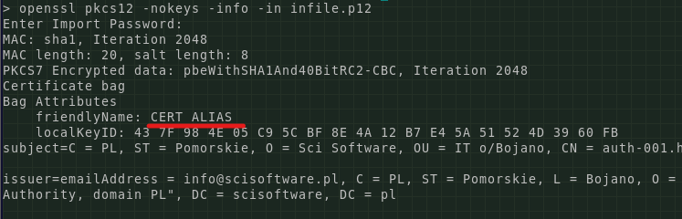
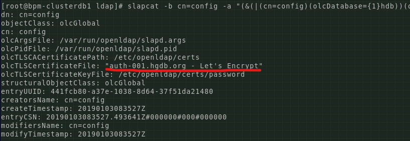

# Serwerowe skrypty pomocnicze
Tutaj znajdziemy szereg skryptów, które wesprą nasze działania na serwerach, na których konfigurujemy usługi SSL

## Opis skryptów i plików

<details><summary>Opis zawartych w katalogu skryptów pomocniczych, które wesprą nas w działaniach administracji serwerami.</summary>
  <p>

   ### ./websphere_refresh_cert.sh
Przykładowa implementacja skryptu realizującego zadania:
1. Odświeżenie certyfikatów  [Let's Encrypt](https://letsencrypt.org/) - polecenie `certbot`
2. Załadowanie odświeżonych certyfikatów do magazynów serwera aplikacji WebSphere.

   ### ./create_pkcs12_from_lets.sh
Przykładowa implementacja skryptu pozwalającego na utworzenie magazynu PKCS12 z plików certyfikatów pozyskanych w usłudze [Let's Encrypt](https://letsencrypt.org/).
Zobacz również opis, który znajdziesz opisie **Generowanie i obsługa magazynu PKCS12**.
   </p>
</details>

## Sposoby na ładowanie certyfikatów
Poniżej opisano kilka metod działania na certyfikatach SSL.

### Generowanie i obsługa magazynu [PKCS12](http://en.wikipedia.org/wiki/PKCS_%E2%99%AF12)
Niektóre z usług potrzebują by klucz prywatny usługi wraz z jej certyfikatem był umieszczony w jednym archiwum PKCS12.
Archiwum takie tworzymy za pomocą polecenia:
```bash
openssl pkcs12 -export\
 -in <plik_certyfikatu_serwera>\
 -name "<nazwa>"\
 -inkey <klucz_prywatny_serwera>\
 -out <nazwa_pliku_archiwum_PKCS12>\
 -CAfile <plik_certyfikatu_CA>\
 -caname "Sci Software Private Certification Authority, domain PL"
```
Tak stworzone archiwum można umieścić w plikach, w których przechowywane są klucze i zaufane certyfikaty za pomocą narzędzia `keytool`:

- Załadowanie certyfikatu CA:
```bash
keytool -import -alias 'scisoftware_ca'\
 -file <plik_certyfikatu_CA>\
 -keystore <plik_przechowywania_kluczy>\
 -storetype JCEKS -storepass ******
```

- Załadowanie archiwum PKCS12:
```bash
keytool -importkeystore -deststoretype JCEKS\
 -deststorepass ******\
 -destkeypass ******\
 -destkeystore <plik_przechowywania_kluczy>\
 -srckeystore <nazwa_pliku_archiwum_PKCS12>\
 -srcstoretype PKCS12\
 -srcstorepass *****\
 -alias "<nazwa>"
```

### OpenLdap - obsługa certyfikatów
W pierwszej kolejności powinniśmy mieć dostęp do magazynu (archiwum) PKCS12. Następnie realizujemy kroki:

#### Przygotowanie bazy certyfikatów

Sprawdź czy istnieje baza certyfikatów. Domyślna znajduje się w katalogu `/etc/openldap/certs`.
Jeżeli jej nie ma, lub jest trefna, to utwórz ja na nowo za pomocą poleceń (jako `root`):
```bash
mkdir -p /etc/openldap/certs
# oczyszczenie katalogu bazy danych 
rm -rf /etc/openldap/certs/*
# Wymyśl skomplikowane hasło dostępu do bazy np. mcteNdkuij0QV3GYPqma7rvsLc9IOfs7i9
# Wrzuć je do pliku:
echo "mcteNdkuij0QV3GYPqma7rvsLc9IOfs7i9" > /etc/openldap/certs/password
# Utwórz bazę danych certyfikatów.
# Gdy zostaniesz poproszony o hasło to użyj tego, które przed chwilą wymyśliłeś:
certutil -N -d /etc/openldap/certs
# Sprawdź czy wszystko gra:
# Lista certyfikatów (teraz pewnie pusta)
certutil -L -d /etc/openldap/certs
# Lista kluczy (teraz pewnie pusta)
certutil -K -d /etc/openldap/certs -f /etc/openldap/certs/password
# ustaw uprawnienia:
chmod a+r /etc/openldap/certs/*.db
chmod a-r /etc/openldap/certs/password
chmod u-r /etc/openldap/certs/password
```

#### Ładowanie certyfikatu do bazy

Gdy już wiesz, że baza certyfikatów jest OK, to wykonaj następujące kroki:
- Sprawdzamy nazwę aliasu certyfikatu w magazynie poleceniem:
```bash
openssl pkcs12 -nokeys -info -in <nazwa_pliku_z_archiwum_PKCS12>
```

- Sprawdzamy nazwę aliasu w obecnej bazie certyfikatów OpenLDAP'a poleceniem:
```bash
slapcat -b cn=config -a "(&(|(cn=config)(olcDatabase={1}hdb))(olcTLSCertificateFile=*))"
```

- Jeżeli nazwy są różne, to musimy się zdecydować na jedną z opcji postępowania:
  - Ustawiamy odpowiedni alias w archiwum PKCS12
  - Ustawiamy odpowiedni alias w konfiguracji OpenLdap
- Gdy się zdecydujemy na zmianę konfiguracji OpenLdap to musimy:
  - Przygotować plik *.ldif, za pośrednictwem którego wydamy polecenie zmiany:
    ```ldif
    dn: cn=config
    changetype: modify
    replace: olcTLSCertificateFile
    olcTLSCertificateFile: "<nazwa_aliasu_w_archiwum_PKCS12>"
    ```
  - Wydać polecenie zapytanie do LDAP: 
    ```bash
    ldapmodify -Y EXTERNAL  -H ldapi:/// -f <nazwa_pliku_ldif>
    ```
- Jak już wszystko będzie spójne wydajemy polecenie ładowania archiwum PKCS12 do bazy certyfikatów OpenLDAP:
```bash
pk12util -i <nazwa_pliku_z_archiwum_PKCS12> -d /etc/openldap/certs
```


